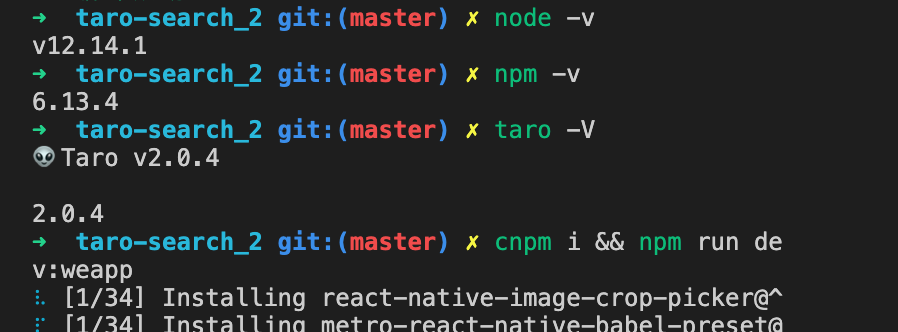

# taro 微信小程序搜索
`taro + hook ` 开发

## 安装依赖

`cnpm i`  or `yarn `

## 启动项目

`npm run dev:weapp `  or 
`yarn dev:weapp ` 

### 本项目是taro 2.0.4 
+ 详细信息

### 修改配置中的appid, 然后运行项目, 在开发者工具中就可以看到效果

#### 如果出现跨域问题, 微信开发者工具 ->详情 ->本地配置 ->不检验合法域名、web-view....(勾上)
